### FP.1 Match 3D Objects
I implemented the "matchBoundingBoxes" function , I divided it into tasks as assigned in the video for this part , first I made an outer loop 
over all keypoint matches , I then checked which bounding boxes are the keypoints enclosed in the current and in the previous frames , I stored the potential
candidates IDs in a multimap as requested , I created a vector of boxIDs in the current frame , and I looped over it to find all the candidates that share
the same boxID in the previous frame and count them.

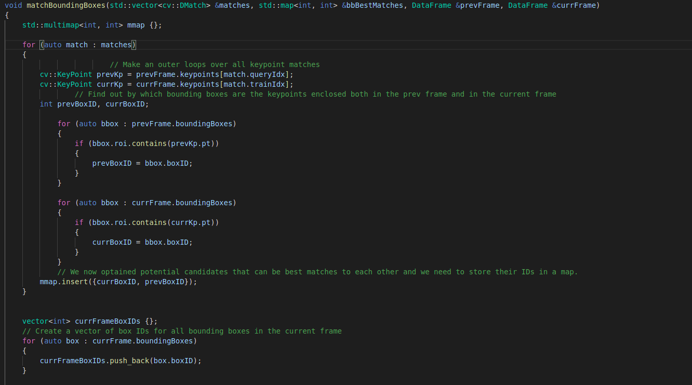
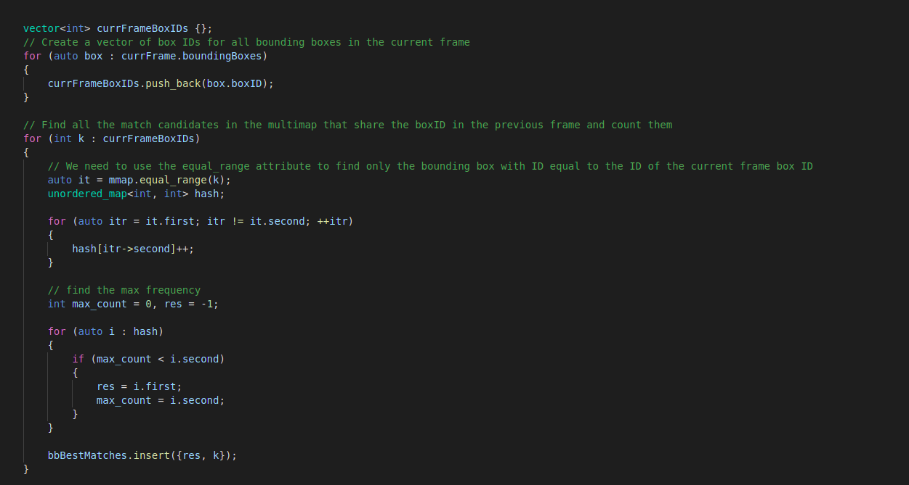

### FP.2 Compute Lidar-based TTC
I implemented the "computeTTCLidar" function by first fitlering the point clouds to avoid points with low reflectivity and points with higher
y-coordinate than the average y-coordinate , I then calculcate the TTC using the average X found in the filtered point clouds to make the
function more robust and more dependent on the average readings instead of taking the lowest point , this way if there was an errorness in some points
the average will cover it in the final reading to get accurate TTC.

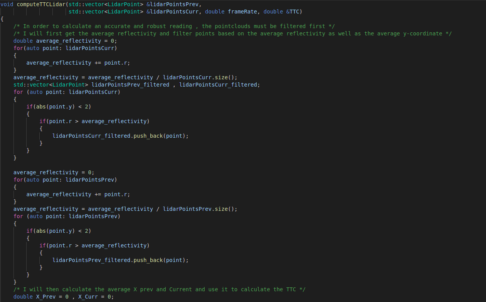
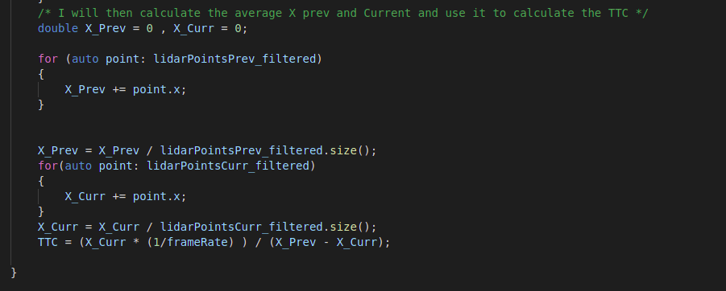

### FP.3 Associate Keypoint Correspondences with Bounding Boxes
I implemented the function "clusterKptMatchesWithROI" by filtering keypoint matched based on the mean distance calculated , I multiplied it by a certain threshold to avoid neglecting too many keypoints.

### FP.4 Compute Camera-based TTC
I implemented the "computeTTCCamera" Just like the implementation in the task assigned during the camera course , I used the median distance ratio as a filter instead of the mean.

### FP.5 Performance Evaluation 1
I noticed that in example 2 and 3 the TTC was higher with a significant amount compared to the previous and preceding examples , as shown in the figures below , I addressed this problem by adding a tolerance to the filters I applied on Lidar PCL when filtering them , this allowed for more PCLs with low reflectivity that were key PCL to be detected and not neglected.

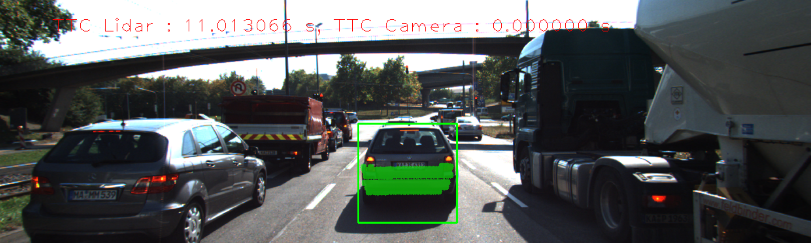
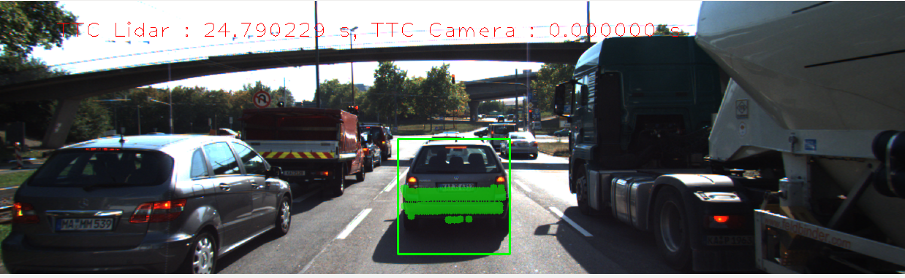
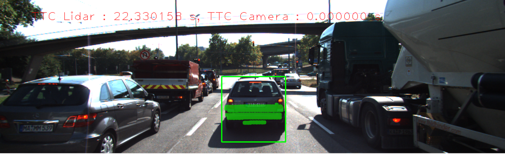
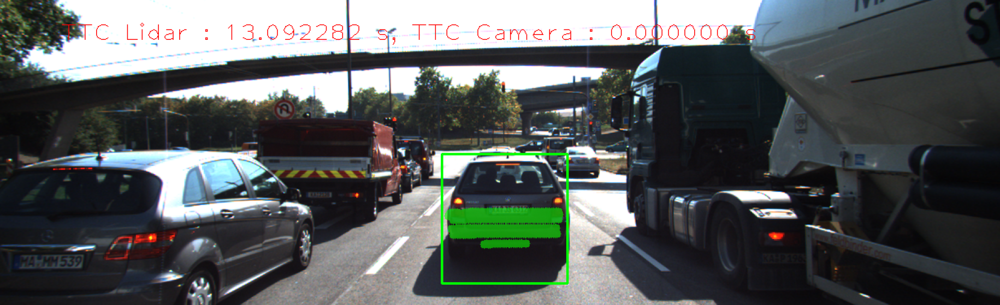
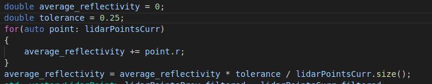
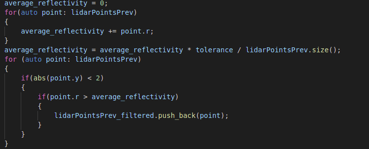
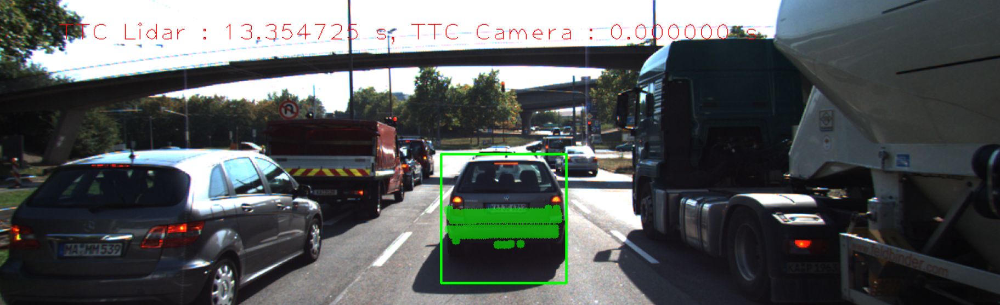
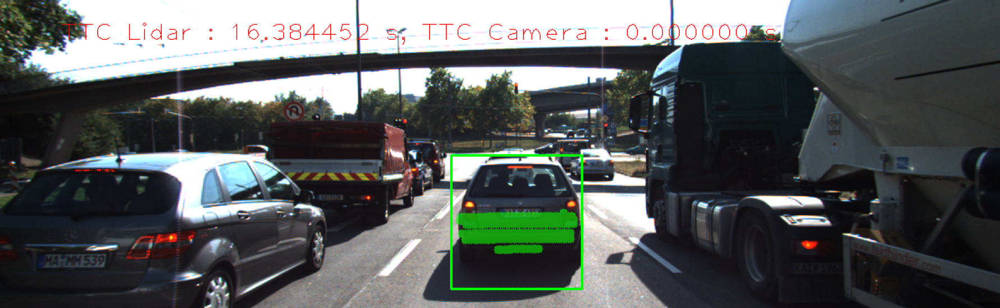

### FP.6 Performance Evaluation 2
From Midterm Project , The best 3 Detector/Descriptors combinations are :
    FAST + BRIEF
    FAST + ORB
    FAST/FREAK
