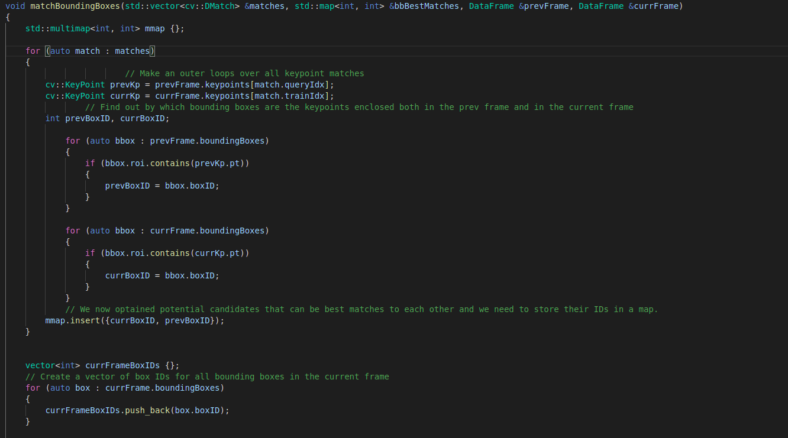
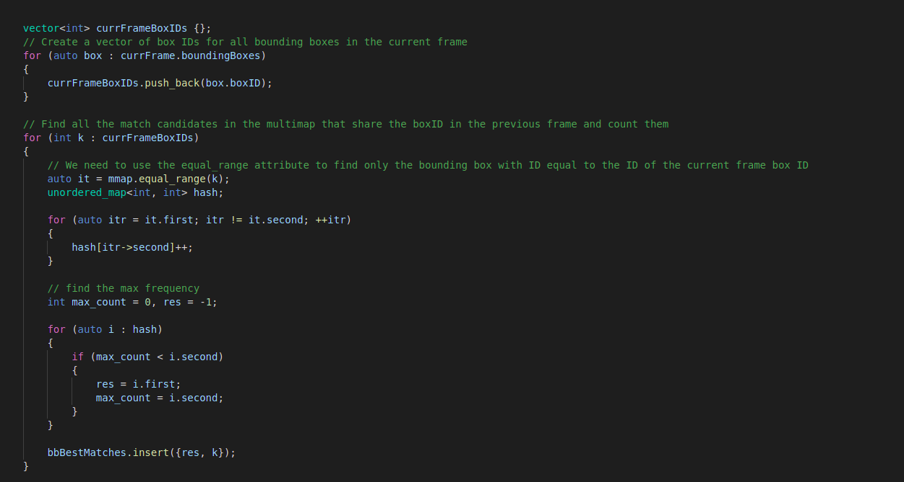

### FP.1 Match 3D Objects
I implemented the "matchBoundingBoxes" function , I divided it into tasks as assigned in the video for this part , first I made an outer loop 
over all keypoint matches , I then checked which bounding boxes are the keypoints enclosed in the current and in the previous frames , I stored the potential
candidates IDs in a multimap as requested , I created a vector of boxIDs in the current frame , and I looped over it to find all the candidates that share
the same boxID in the previous frame and count them.

